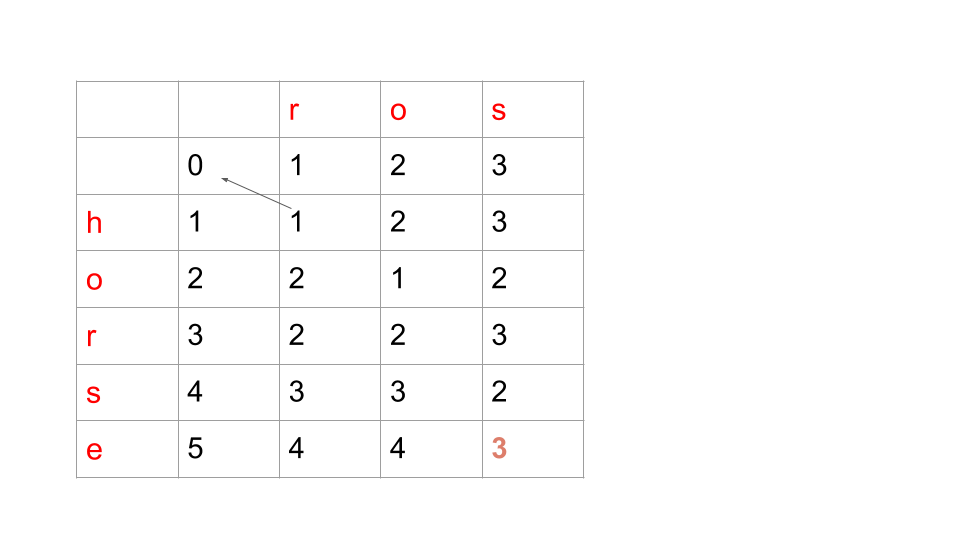

[//]: # (@Author  : xu.junpeng)
[//]: # (@Time    : 2020/7/26 1:30 下午)
## [题目链接]()

## 思路
关键的方案在于动态转移方程的
## 分析过程
以题目中
给的demo为例，word1 = "horse", word2 = "ros"

横轴为i， 纵轴为j，将图中的表格理解为dp二维数组，以(r,h)为（1，1）
dp[1][1]表示将h转为r，或者r转为h所需要的步骤
dp[3][5]的意思代表将horse转换为ros所需要的步骤
dp[3][4]可以理解为hors转为ros的步骤，在dp[2][3]的基础上增加增加"s"
dp[2][3]可以理解为hor转为ro的步骤, 在dp[1][1]的基础上增加"r"，转换是双向可以操作的，就不多写了
dp[1][2]可以理解为ho转到r的步骤, 在dp[1][1]的基础上增加"o"
dp[1][1]可以理解为h转到r的步骤, 直接将h替换为r，或者r替换为h
dp[0][0]可以理解为""转到""的步骤,因为是相等的，不需要转换

动态转移方程就很明显了

## 存在的问题
初始化dp方程的时候要注意与两层for循环遍历的顺序要保持一致
## 代码
```python
class Solution:
    def minDistance(self, word1, word2):
        dp = [[0 for _ in range(len(word2) + 1)] for _ in range(len(word1) + 1)]
        for i in range(len(word2) + 1):
            dp[0][i] = i
        for j in range(len(word1) + 1):
            dp[j][0] = j
        for i in range(1, len(word1) + 1):
            for j in range(1, len(word2) + 1):
                if word1[i - 1] == word2[j - 1]:
                    dp[i][j] = dp[i - 1][j - 1]
                else:
                    dp[i][j] = min(dp[i - 1][j], dp[i][j - 1], dp[i - 1][j - 1]) + 1
        return dp[-1][-1]
```

## 结果
```

```
## 总结
